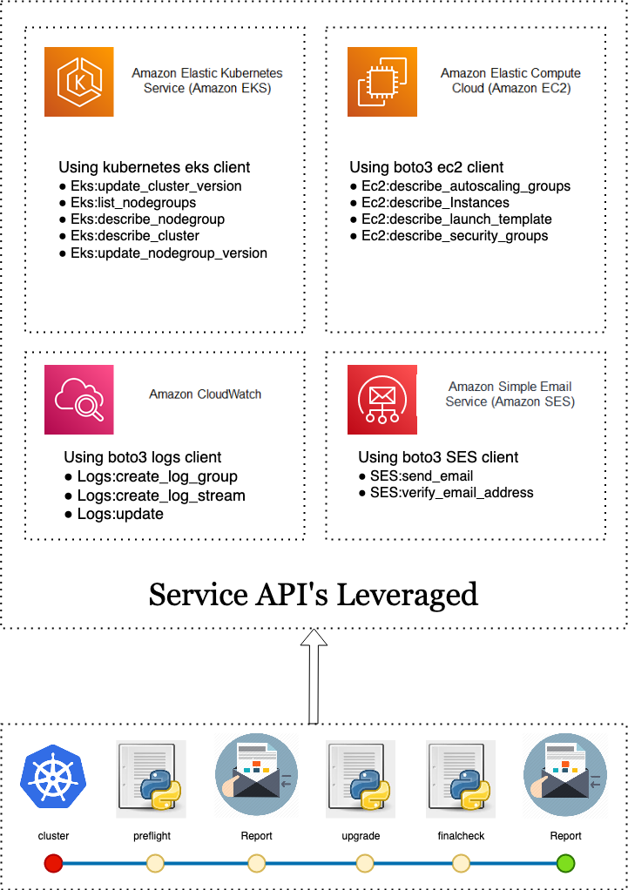
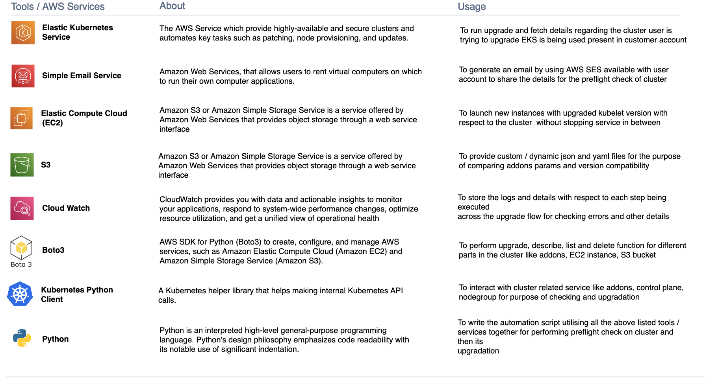
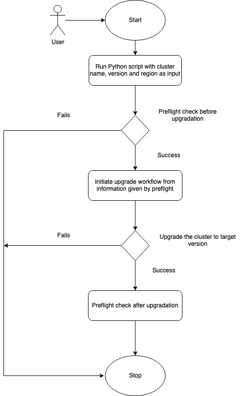
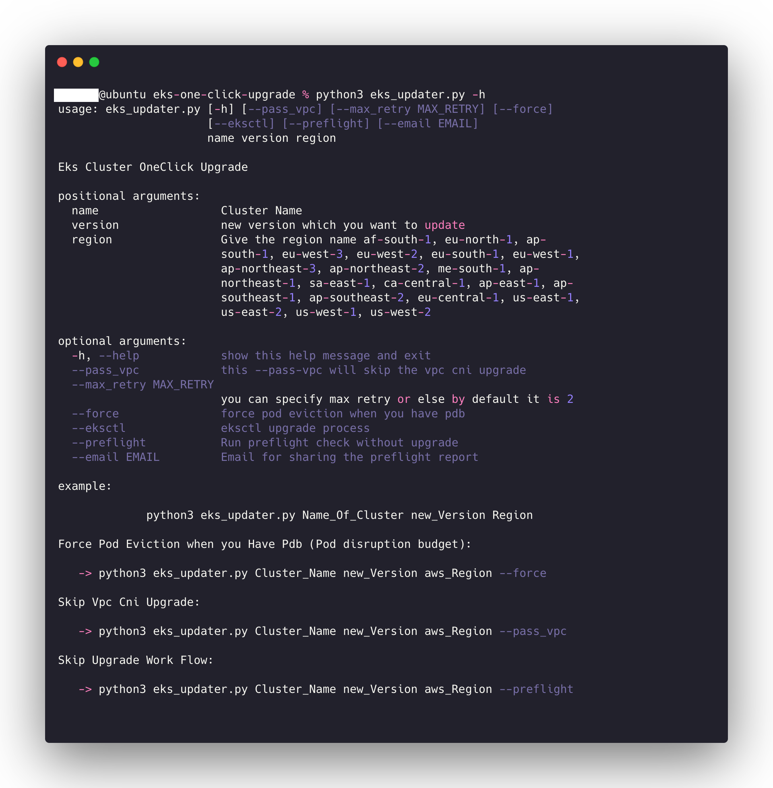
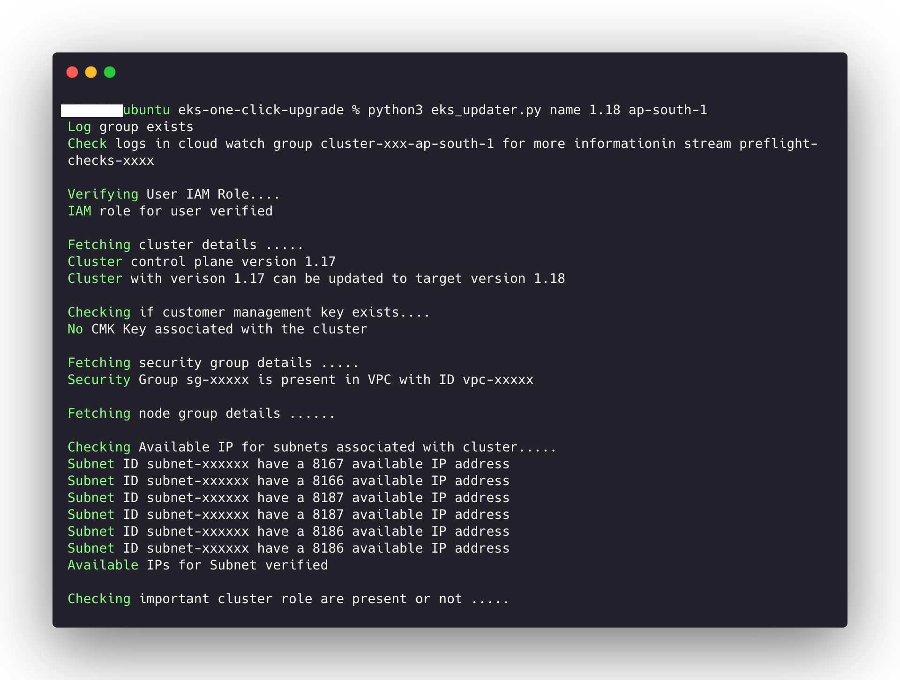

# Amazon EKS Upgrade Utility

<p align="center">
<a href="">
    
  </a>  
  <a href="">
    
  </a>  
<a href="">
    
  </a>  
</p>

Amazon Elastic Kubernetes Service (Amazon EKS) is a managed service that you can use to run Kubernetes on AWS without needing to install, operate, and maintain your own Kubernetes control plane or nodes. Kubernetes is an open-source system for automating the deployment, scaling, and management of containerized applications.
Working with EKS starts with creating a cluster and an Amazon EKS cluster consists of two primary components:

1. Amazon EKS control plane
2. Amazon EKS nodes that are registered with the control plane

The current process of EKS cluster upgrade includes:

1. Check the Kubernetes object compatibility with regards to API specific Changes
2. Check the version of Core Kubernetes Components and do changes as per the changes required in the newer
   version which is compatible with the targeted version.
3. Check worker node version and control plane version and ensure that they are in same version
4. Check Enough IPs are there in the Subnet and the Customer account has not reached the ENI limit
5. Do Control Plane Upgrade
6. Do Node Upgrade and graceful shift of workloads to newer instances
7. Check for stability of Core Kubernetes Components after Cluster Upgrade.

## Workflow

The process of EKS Cluster upgradation is divided majorly into three steps carrying out the task of doing preflight check, cluster upgradation and post upgradation check for verifying if the different components have upgraded successfully.

## Preflight Check

To upgrade the cluster successfully without any roll backs there are multiple parameters, versions associated with the cluster which have to be checked beforehand in order to initate its process. To verify all such variable parameters and check version compatibility, pre-flight check for the following components is carried out before initiating a cluster upgrade.

1. Target Version Compatibility Check - Since any cluster in eks is always allowed to upgrade to one above version and not beyond a check for the target version is done as with each upgrade there are a lot of configuration changes and upgrading directly to a higher version can lead to breakdown of the services being provided by it.
2. Customer Management Key - A cluster might have CMK Key associated with it and so it is essential to verify if the same exists in users account to carry out the upgradation process
3. Security Group - Every cluster has a security group associated with it to restrict and allow the flow of traffic across it and therefore it has to be verified whether it exists in the users VPC or not.
4. Nodegroup and worker node detail - EKS cluster supports multiple types of node groups and so for the purpose of upgradation and there kubelet version compatibility check they have to classify to proceed with the upgrade step.
5. Subnets - A minimum of 4-5 free IP are required when doing a cluster upgrade to launch new nodes and nodegroup with the old ones to keep the services of the cluster running while the upgrade is going on and so a check for them
Target version compatibly check
6. Cluster Roles - There are a lot of important cluster roles required during the upgradation related to addons, nodes and other components of cluster without which cluster upgrade can’t be executed successfully.
7. Pod Security Policy - Eks privileged role has to be checked to be present with the current pod security policy.
8. cluster addons - The cluster addons like kube-proxy, vpc-cni and cordns are essential for running various services across the cluster and sometimes there are certain variable parameters present by them which have been customized by the users end as per the functionality the cluster supports which have to captured while upgradation and then added during the upgrade for the services to continue working smoothly as before.
9. Pod Disruption Budget - The existence of PDB has to be checked in the cluster and minimum and maximum available with it has to be taken into account while upgrading.
10. Horizontal Pod and Cluster Autoscaler - As the other components are upgraded to the compatible image version, a check firstly to check of these are present and then to upgrade them to compatible version with respect to the control plane. Deprecated API check - With every new version release there are a certain set of API which get deprecated and so a check for the resources running over them has to be done so that they do not break post upgrade

After the pre-flight check is completed for the cluster an email is generated summarizing the details for all the above steps for the user and the status of preflight. If preflight completes successfully the upgrade process is initiated or else the process of upgradation is terminated after pre-flight.

### Upgrade Flow

1. Control plane upgrade - Upgrades control plane components i.e API server ,etcd ,kube-scheduler,kubelet etc to target version.
2. Identification of Managed and Self managed node - The worker nodes are identified as EKS managed and self managed to perform upgrade.
3. Managed Node group update - updates managed node group to the specified version
4. Self Managed Nodegroup update
   - Launch new nodes with upgraded version and wait until they require ready status for next step.
   - Mark existing nodes as un-schedulable.
   - If pod disruption budget (PDB) is present then check for force eviction flag (--force) which is given by user, only then evit the pods or continue with the        flow.

### Objective

1. **To upgrade the cluster in one click** : There are many steps involved in updating a cluster and our main objective is to automate all the steps involved in EKS Cluster Upgradation to one click.
2. **To reduce manual effort and time** : To update an EKS cluster , customers have to manually perform every step which is quite time taking and also a hectic task so, our objective is to reduce that manual intervention and also to save customer’s time.

### Architecture

This is the architecture of EKS One Click Upgrade:
<p align="center">

</p>

### Components used



### Workflow

Once the user executes the python script, a pre-flight check is initiated where multiple parameters and versions associated with the cluster are verified. If this check is performed successfully, then the upgrade workflow will be initiated and the cluster along with its components will be upgraded to the target version. After the upgradation process, a final check is done and an email is generated summarizing the details of cluster.

<p align="center">

</p>

### How to use EKS One Click Upgrade via CLI

```zsh

$ aws eks update-kubeconfig --name eks-cluster-name --region aws-region 
$ kubectl edit configmap aws-auth -n kube-system

# Add the IAM user to mapUsers. For example:
mapUsers: |
  - userarn: arn:aws:iam::XXXXXXXXXXXX:user/testuser
username: testuser
    groups:
      - system:masters
Add the IAM role to mapRoles. For example:
mapRoles: |
  - rolearn: arn:aws:iam::XXXXXXXXXXXX:role/testrole
    username: testrole
    groups:
      - system:masters
```

### Roles and Policies required

In order to proceed with the upgrade and preflight workflow for your EKS cluster, below mentioned permissions are required as part of the IAM user being used to complete with the process. Below mentioned IAM policy can be used to attach to a user in order to grant access to required AWS service and related actions to complete the processs for eks-one-click upgrade

For more information related to steps on how to create and attach IAM policy, you can follow the below mentioned steps in AWS Documentation

[https://docs.aws.amazon.com/apigateway/latest/developerguide/api-gateway-create-and-attach-iam-policy.html](https://docs.aws.amazon.com/apigateway/latest/developerguide/api-gateway-create-and-attach-iam-policy.html)

```json
{
    "Version": "2012-10-17",
    "Statement": [
        {
            "Sid": "eksoneclickrole",
            "Effect": "Allow",
            "Action": [
                "autoscaling:DescribeAutoScalingInstances",
                "eks:UpdateClusterVersion",
                "ec2:DescribeInstances",
                "eks:DescribeFargateProfile",
                "ses:VerifyEmailIdentity",
                "logs:DescribeLogStreams",
                "ses:GetSendQuota",
                "autoscaling:DescribeLaunchConfigurations",
                "eks:UpdateAddon",
                "eks:ListAddons",
                "sts:GetAccessKeyInfo",
                "autoscaling:CreateLaunchConfiguration",
                "ssm:*",
                "ses:VerifyDomainIdentity",
                "eks:DescribeAddon",
                "sts:GetSessionToken",
                "eks:UpdateNodegroupVersion",
                "logs:CreateLogStream",
                "eks:DescribeNodegroup",
                "autoscaling:DescribeAutoScalingGroups",
                "eks:ListUpdates",
                "autoscaling:UpdateAutoScalingGroup",
                "eks:DescribeAddonVersions",
                "ses:ListIdentities",
                "autoscaling:TerminateInstanceInAutoScalingGroup",
                "iam:GetRole",
                "eks:ListNodegroups",
                "logs:DescribeLogGroups",
                "ec2:DescribeLaunchTemplates",
                "autoscaling:SetDesiredCapacity",
                "ses:SendRawEmail",
                "ses:GetIdentityVerificationAttributes",
                "logs:CreateLogGroup",
                "logs:PutLogEvents",
                "config:DescribeConfigurationRecorderStatus",
                "ec2:DescribeSecurityGroups",
                "ec2:DescribeImages",
                "eks:ListFargateProfiles",
                "config:DescribeConfigurationRecorders",
                "eks:DescribeUpdate",
                "ses:DeleteIdentity",
                "eks:DescribeCluster",
                "sts:GetCallerIdentity",
                "eks:ListClusters",
                "ec2:DescribeSubnets"
            ],
            "Resource": "*"
        }
    ]
}
```

### Folder Structure

```bash
eks-upgrade/
├── src/
│   ├── S3Files/
│   ├── __init__.py
│   ├── boto_aws.py
│   ├── eks_get_image_type.py
│   ├── eksctlfinal.py
│   ├── ekslogs.py
│   ├── k8s_client.py
│   ├── latest_ami.py
│   ├── preflight_module.py
│   └── self_managed.py
├── __init__.py
├── cli.py
└── starter.py
```

## Installation

```zsh
pip install eksupgrade
```

## Usage

```zsh

To Get Help Use [-h] 

Usage :

    eks-one-click-upgrade % eksupgrade -h 

    usage: eksupgrade [-h] [--pass_vpc] [--max_retry MAX_RETRY] [--force]
                     [--eksctl] [--preflight] [--email EMAIL]
                     name version region

To Receive Email Report Use [ --email]

Usage :

    eks-one-click-upgrade % eksupgrade Cluster_Name new_Version aws_Region --email okaboi@example.com

To Skip The upgrade and if you only want to perform preflight check [ --preflight ]

Usage :

    eks-one-click-upgrade % eksupgrade Cluster_Name new_Version aws_Region --email okaboi@example.com --preflight

To Skip Vpc-cni Addon Upgrade use [ --pass_vpc ]

Usage :

    eks-one-click-upgrade % eksupgrade Cluster_Name new_Version aws_Region --pass_vpc

Add Number of retry you want the script to peform by default it is 2 [ --max_retry ]

Usage :

    eks-one-click-upgrade % eksupgrade Cluster_Name new_Version aws_Region --max_retry 5

To Utilize Force Pod Eviction when you Have Pdb (Pod disruption budget) [ --force]

Usage :

    eks-one-click-upgrade % eksupgrade Cluster_Name new_Version aws_Region --pass_vpc

```

## Command Line Interface (CLI)

<p align="center">


</p>

## Security

See [CONTRIBUTING](CONTRIBUTING.md#security-issue-notifications) for more information.

## License

This library is licensed under the MIT-0 License. See the [LICENSE](LICENSE) file.

### 🤝 Contributing

- Pull requests are welcome. For major changes, please open an issue first to discuss what you would like to change.
- Please make sure to update tests as appropriate.
